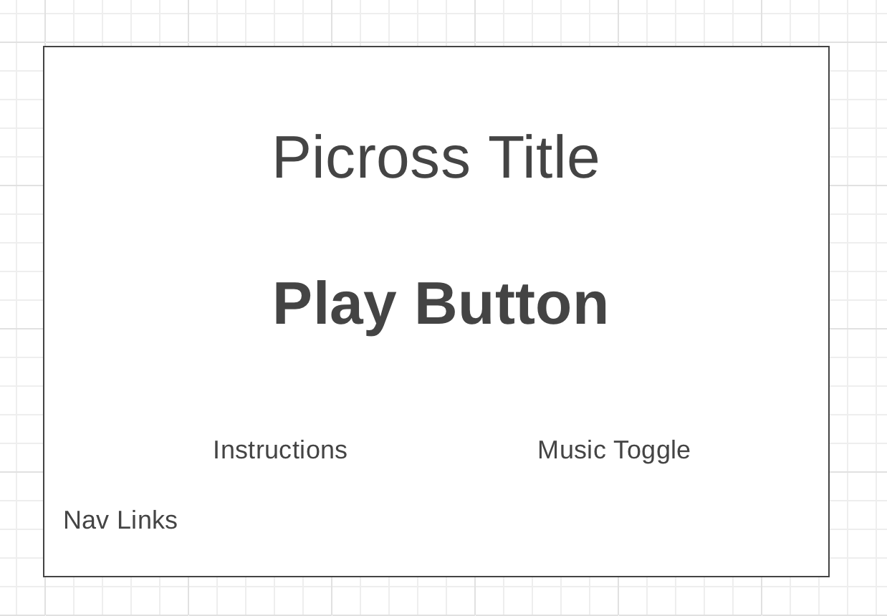
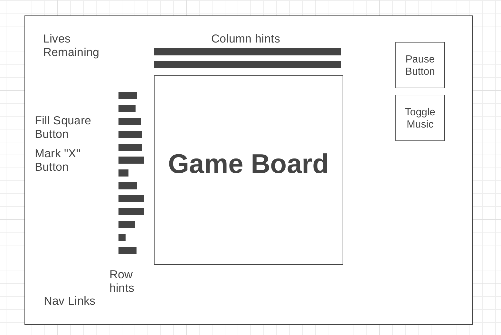
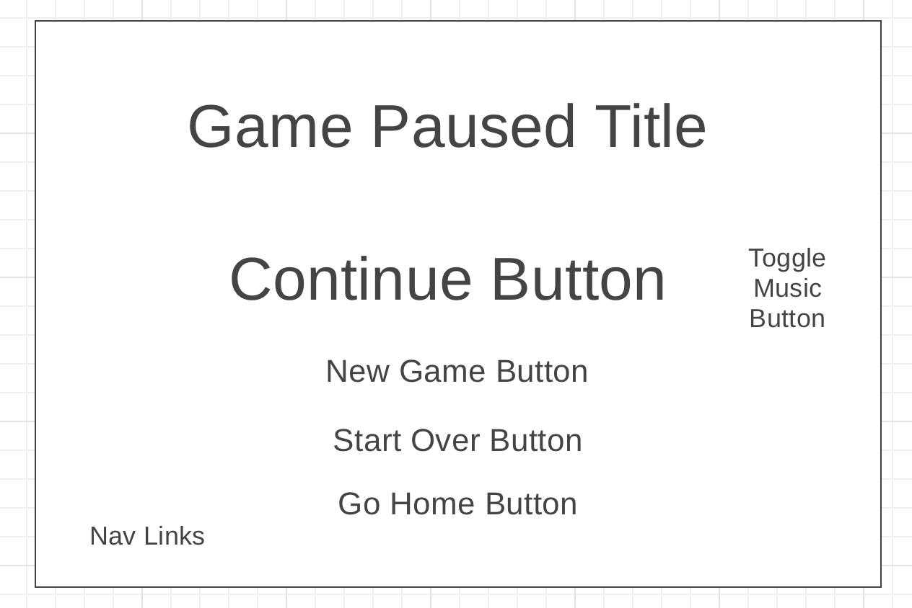

Project Proposal: Picross

Background

Picross is a logic puzzle game in which tiles in a grid are filled in or crossed out based on information provided by numbers along the top and side of the grid. The rules of picross are simple:

Along each row and column of the grid are numbers which represent the number of tiles that need to be filled in the corresponding line. Numbers separated by a space indicate that there is at least 1 blank space in the line between the two corresponding tile segments. Based on the information provided by the numbers, a player may either fill in a tile indicating that they believe the tile is a part of the hidden picture, or place an x on the tile indicating the tile is not a part of the picture. When the grid is filled in correctly and completely, the player wins and the hidden picture is fully revealed. 

Although there are numerous versions of picross each with their own distinct formats of grid size and difficulty, my version will primarily consist of a 10x10 grid size and provide puzzle of roughly medium level difficulty. 

Functionality & MVPs

In my Picross game, the user will be able to:
Pause, reset, and toggle music of the game board.
Fill in or place an “X” in tiles of the game board.
Generate a new randomly selected puzzle.
Receive feedback for clearing a line, filling in an incorrect square, solving the puzzle, or failing to solve the puzzle.

Wireframes

 Nav links include links to this project's Github repo, my LinkedIn, and the About modal.
 Instructions describe the interface and controls.
Music toggle toggles the music on or off.
Play button selects a puzzle from a set of puzzles and generates it the Main Game Screen.

----------------------------------------------------------------------------

The lines beside column hints indicate where the number hints for the column will appear.
Fill square toggle causes the cursor to fill any tile it clicks.
Mark “X” button causes the cursor to mark any tile it clicks with an x, preventing that tile from being filled.
Lives remaining indicates the number of incorrect guesses available before a loss.
Pause button opens the Pause screen.

----------------------------------------------------------------------------

The continue button continues the game.
The new game button generates a new puzzle and resets the board as well as the life count.
 The start over resets the current board as well as the life count.
The go home button ends the current game and takes the user to the home page.

Technologies, Libraries, APIs

The technologies this project will utilize are:
The Canvas API to render the game board
Webpack to bundle Javascript code
Babel to transpile source code making it accessible to a wide range of browsers
Npm to manage project dependencies 

Implementation Timeline

Friday Afternoon & Weekend: (BuildFoundation/Gather Assets) Setup project foundation. Setup webpack. Create 10x10 grid with ability to have tiles filled in on click or be marked with an x. Have numbers appear on the side of the grid. Create grid and tile classes. Implement a basic pause and unpause button.
Monday: (Develop Logic) Develop logic of grid. Setup up a basic working puzzle. Give feedback of mistakes with a red x and life decrement. 
Tuesday: (Create Playability) Finish basic playable game. Add win screen which displays finished picture, the pictures name, and gives option to play new game or go home. Add roughly 8 or more puzzles and ensure one is randomly selected for a new game. 
Wednesday: (Refine User Experience) Create a homepage with instructions, settings, art, and play button. Add music and a background to game-board and home page. Add reset, home, and new game option to pause button. Make finishing touches.
Thursday Morning: (Ship) Deploy to Github pages.

Bonus features

Some updates that could improve the games functionality include:
A level editor allowing a user to create new puzzles.
A level selector which lists all completed levels.
Customizable music and theme options.

